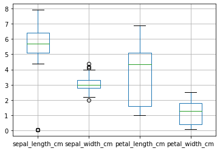

# The Data Analysis

[TOC]

## Start

## Steps for analytics project

1. Convert the business problem to a analytic problem - ==clarity brings mastery==

2. Data exploration - ==data is your friend==

   1. what is there in data, how much data you have, quality of data, mean, var, counts, max, what is important, what is waste etc. 

3. Data preparation - ==fry it==

   1. highly influenced by the modelling step
   2. general : missing values fix, outliers issue, variables transformation, develop training, testing, validation data, 
   3. missing values : identify => look for pattern and fix or ignore or impute with mean or median, or specific to cases 
   4. outliers : 
      1. lots of data - ignoring will not hurt
      2. if only few outliers - fix them manually or can fix by putting 1 percentile value or 99th percentile value 

4. Modelling - ==the function==

5. Validation - ==know where you stand==

   1. justify the results of logistic regression analysis
      1. concordance -  ability to discriminate b/w event happening and not happening
      2. lift - how good it is compared to random selection
      3. confusion matrix

6. Implementation and tracking - ==erosion and repairing== 

   

## A checklist and short codes

Assuming the data is read in a pandas data-frame as **df.**

Take a pen and paper and while analyzing mistakes in data, note down for fixing

- [ ] ```python
  #---------------------------------------
  # identify the missing value indicator
  #----------------------------------------- 
  
  # ask the data maker what they put for missing value
  # say they put 'NA', or 'na'
  
  missing_fill = ['NA', 'na']
  df = pd.read_csv( filename, fillna = missing_fill )
  
  # now the pandas knows how to fill the missing values
  ```

  

- [ ] understand the quirks of the dataset and the potential errors

  ```python
  #-----------------------------------------------------------
  # understand the quirks of the dataset and potential errors
  #------------------------------------------------------------
  
  # some basic first steps are
  
  df.head()
  df.info() # a very important method to see the types of data
  df.describe() 
  # explicitly describe non-numerical data
  df.describe ( include = ['object', 'bool'])
  
  # count values
  df[col].value_counts() ; 
  # for ratio
  df[col].value_counts(normalize = True)
  
  seaborn.pairplot ( df )
  df.is_null().any() ; df.is_null().sum()
  
  #-------------------
  # additional methods
  #--------------------
  print ( df.shape )
  print( df.columns )
  
  # bool to int64
  # col : a column name
  df[col] = df[col].astype('int64')
  
  # check for unique values in cols
  df[col].unique()
  ```

  

- [ ] variable type ; continuous, ordinal , categorical, missing, censored

  ```python
  # understand manually the features
  # you can see the missing data by
  df.is_null().any()
  ```

  

- [ ] check the clear coding errors

  ```python
  # the above basic first steps should be enough
  # but you can further check
  
  for col in df.columns:
      print(f"{col} : { len( df[col].unique() )}" ) 
      
  # this will help you analyse what you expect is what the data have
  
  ```

  

- [ ] check for unit of measurements

  - [ ] histogram, bar-plot can help 

    ```python
    # analyse the scale, outlier to come for an assumption 
    df.hist()
    df.boxplot()  
    df.plot()
    
    # access the elements you are finding anamoly at using
    # df.loc [ logic ]
    
    df.loc [ df['sepal_length_cm'] < 1 ]
    df.loc [ df['petal_width_cm'].isnull() ]
    
    ```

    an example graph 

    

    

## Interview prep

- [workera.ai resources for data analyst](https://workera.ai/resources/data-science-case-study-interview/) 
- [blog on common questions](https://analyticsindiamag.com/common-analytics-interview-questions/)
- [55 questions](https://learning.naukri.com/articles/top-20-data-analytics-interview-questions-answers/) 
- [pandas cheatsheet](https://github.com/pandas-dev/pandas/blob/master/doc/cheatsheet/Pandas_Cheat_Sheet.pdf)

### Data understanding and querying

- [pandas basics](https://www.kaggle.com/rohitdavas/topic-1-exploratory-data-analysis-with-pandas/edit) 
- [Assignment](https://www.kaggle.com/kashnitsky/a1-demo-pandas-and-uci-adult-dataset), [MySolutions](https://www.kaggle.com/rohitdavas/a1-demo-pandas-and-uci-adult-dataset?scriptVersionId=45449751)

## End

[Home](https://rohitdavas.github.io/) 	[Resume](https://rohitdavas.github.io/resume/Rohit_Kumar.pdf)	[davarohit@gmail](https://mail.google.com/mail/u/0/?view=cm&fs=1&to=davasrohit@gmail.com&tf=1)	[top](#Start) 